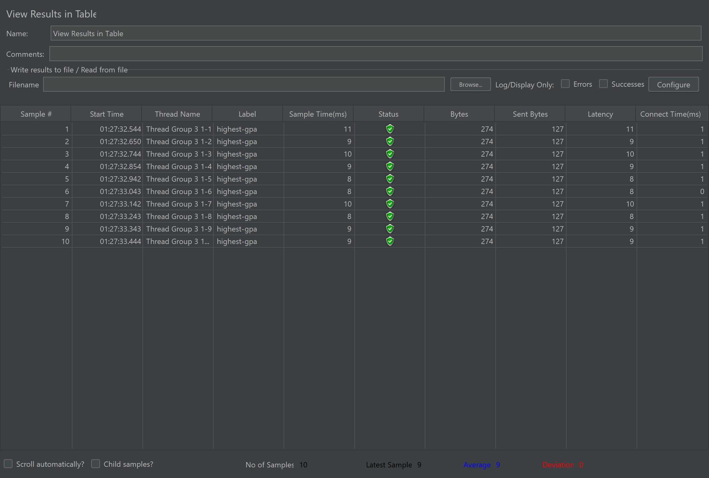

Nama: Muhammad Daffa'I Rafi Prasetyo

NPM: 2206029191

### What is the difference between the approach of performance testing with JMeter and profiling with IntelliJ Profiler in the context of optimizing application performance?
Pendekatan testing dengan JMeter dan IntelliJ Profiler memiliki perbedaan tujuan dan fungsi dalam testing, namun saling melengkapi. JMeter digunakan untuk mengukur kinerja aplikasi dari sudut pandang pengguna (end user), dengan memberikan beban pengguna yang tinggi (Dalam contoh kasus ini sebanyak 10 pengguna) kemudian mengevaluasi respons aplikasi terhadap beban tersebut. Sedangkan, IntelliJ Profiler bertujuan untuk menganalisis kinerja internal aplikasi dengan melihat waktu eksekusi dan penggunaan atau pemanggilan fungsi-fungsi yang ada. Tujuannya adalah menemukan titik-titik lemah aplikasi agar dapat dilakukan optimasi.

### How does the profiling process help you in identifying and understanding the weak points in your application?
Proses profiling membantu dalam mengidentifikasi dan memahami titik lemah dalam suatu aplikasi dengan memperlihatkan waktu yang dihabiskan di setiap pemanggilan fungsi, banyaknya fungsi yang dipanggil, penggunaan memori, dan lain-lain. Ini memungkinkan kita agar dapat fokus pada bagian-bagian mana yang memerlukan di-refactor atau optimasi untuk meningkatkan kerja aplikasi.

### Do you think IntelliJ Profiler is effective in assisting you to analyze and identify bottlenecks in your application code?

Menurut saya, IntelliJ Profiler efektif dalam membantu menganalisis dan mengidentifikasi hal yang memperlambat kerja aplikasi. Intelllij Profiler menyediakan visualisasi yang jelas tentang penggunaan CPU, memori, dan penggunaan thread, serta informasi tentang metode-metode yang memakan waktu eksekusi tinggi. Walaupun saya membutuhkan pembiasaan untuk membaca hasil yang diberikan Intellij Profiler. Dengan informasi ini saya dapat menentukan di mana refactor perlu dilakukan untuk meningkatkan kerja aplikasi.

### What are the main challenges you face when conducting performance testing and profiling, and how do you overcome these challenges?
Salah satu tantangan yang saya temui dalam melakukan testing dan profiling adalah memastikan bahwa refacor yang dilakukan dalam proses optimasi tidak mempengaruhi fungsionalitas aplikasi dan memberikan hasil yang diharapkan. Output yang dihasilkan sebelum di refactor harus sama seperti output yang dihasilkan setelah di refactor. Kode yang belum direfactor membutuhkan waktu yang cukup lama, sehingga cukup menghambat saya. Data yang besar juga membutuhkan waktu dalam mengecek bahwa outputnya tidak berubah setelah dilakukan refactor.

### What are the main benefits you gain from using IntelliJ Profiler for profiling your application code?
Menggunakan IntelliJ Profiler untuk melakukan profiling memberikan manfaat utama dalam mengidentifikasi dan memperbaiki kode yang lambat. Intellij Profiler memberikan visualisasi yang jelas tentang penggunaan CPU, alokasi memori, dan aktivitas thread, serta kemampuan untuk melihat call stack, Saya dapat dengan cepat menemukan letak fungsi yang memerlukan refactor dan melakukan peningkatkan kode dengan cepat.

### How do you handle situations where the results from profiling with IntelliJ Profiler are not entirely consistent with findings from performance testing using JMeter?
Ketika hasil dari profiling  dengan IntelliJ Profiler tidak konsisten dengan testing dari JMeter, Saya akan melakukan pengujian ulang beberapa kali untuk memastikan hasil yang diberikan. Saya juga menunggu beberapa waktu untuk memastikan bahwa aplikasi berjalan secara stabil agar hasilnya konsisten. Saya juga memastikan dan memeriksa kembali konfigurasi dan aplikasi ketika melakukan pengujian.

### What strategies do you implement in optimizing application code after analyzing results from performance testing and profiling? How do you ensure the changes you make do not affect the application's functionality?
Setelah menganalisis hasil dari testing dan profiling, strategi saya dalam melakukan optimasi mencakup memperbaiki algoritma, mengurangi panggilan ke database yang lambat, serta mengurangi adanya duplikat kode (jika ada). Selain itu, saya juga mencari-cari sumber ke google untuk mencari metode terbaik dalam memperbaiki kode saya. Saya juga harus mengeksplor lebih dalam mengenai Spring boot agar dapat menggunakan fungsi yang lebih optimal yang sudah disediakan oleh Spring boot.

## Bukti Menjalankan JMeter pada Command Line

#### /all-student-name

#### /highest-gpa

## Bukti Testing Menggunakan JMeter

### Sebelum dilakukan optimisasi

#### /all-student-name

#### /highest-gpa

### Setelah dilakukan optimisasi

#### /all-student-name

#### /highest-gpa

Terlihat jelas dari screenshot diatas bahwa endpoint all-student-name dan endpoint highest-gpa meningkat lebih dari 20%, hal ini terbukti dengan menurunnya angka pada Sample Time.

